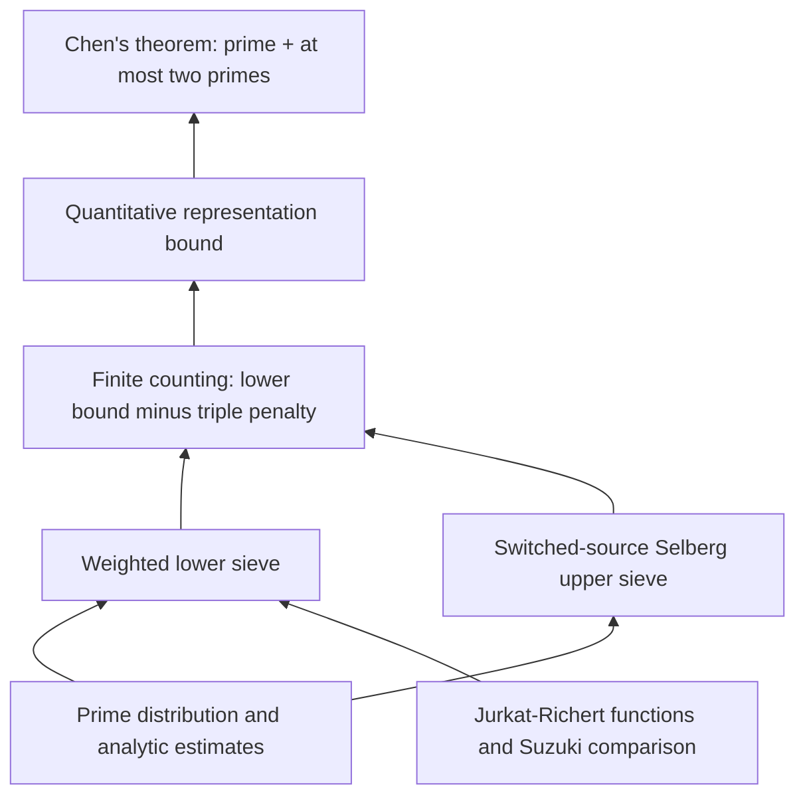

# goldbach-lean

A Lean 4 project formalizing progress toward **Goldbach's conjecture** and
building reusable analytic number theory, with **Chen's 1+2 theorem** and
**Li–Liu's 1+1.9 theorem** formalized. Stronger results remain a research direction.

The Li–Liu result proves:

> Every sufficiently large even natural number has a representation
> `N = p + r*q`, where `p` and `q` are prime, `r = 1` or `r` is prime, and
> `r^10 ≤ q^9`.

It also proves the strict `0.0004` lower bound for the number of distinct prime
first summands satisfying this condition, in the Liu singular-series normalization.
The earlier **1+2** result remains available through its original import and
public names: every sufficiently large even natural number is a prime plus
another prime or a product of two primes, whose factors may be equal.

The [release notes](docs/RELEASE_NOTES.md) describe the new results and retain the
historical v1.0.0 record. The [recorded build benchmarks](docs/BUILD_BENCHMARK.md)
measure the v1.0.0-rc1 and v1.0.0 **1+2** developments.

**[Project homepage](https://subfish-zhou.github.io/goldbach-lean/)**
· **[Lean API documentation](https://subfish-zhou.github.io/goldbach-lean/docs/)**
· **[Interactive proof Blueprint](https://subfish-zhou.github.io/goldbach-lean/blueprint/)**

The Lean API documentation covers all four project libraries, with declaration
search, source links, and import navigation. See [how the website is built](docs/DOCUMENTATION.md).

| Read the mathematics | Explore the proof | Check the result |
|---|---|---|
| [Theorems and normalization](docs/THEOREMS.md) | [Architecture and source map](docs/ARCHITECTURE.md) | [Verification and trust boundary](docs/VERIFICATION.md) |

## Proof at a glance

The following roadmap describes the Chen 1+2 route. The Li–Liu extension has
its own [public entry and source route](docs/ARCHITECTURE.md#liliu-extension).



This is a mathematical roadmap: arrows point from an input to the result it
supports, and may summarize several modules. The [source map](docs/ARCHITECTURE.md)
separates this view from direct imports and compiled declaration dependencies.

The [interactive Blueprint](https://subfish-zhou.github.io/goldbach-lean/blueprint/)
renders selected declaration dependencies from LeanArchitect, with links to their
Lean source. Continuous integration (CI) validates the documentation and assembles
the project homepage, Lean Doc, and Blueprint into one website, published from `main`. The Blueprint remains available as the `goldbach-blueprint` artifact.

## Main results

The two developments have separate imports over shared analytic foundations.
Use `import Goldbach` for the established 1+2 interface,
`import Goldbach.OnePlusOneNine` for 1+1.9, or `import Goldbach.All` for both.

```lean
import Goldbach.OnePlusOneNine

#check Goldbach.one_plus_one_nine
#check Goldbach.one_plus_one_nine_real
#check Goldbach.one_plus_one_nine_count
#check Goldbach.one_plus_one_nine_lower_bound
```

The natural-power theorem retains the exact `r^10 ≤ q^9` condition; the real-power
version states `r ≤ q^((19/10 : ℝ) - 1)`. The count theorem gives
`(1/2500) * liuSingularSeries N * N / (Real.log N)^2 < D19 N`, where `D19`
counts different eligible primes `p`. The stronger lower-bound family allows
each fixed real `κ < 515093/800000000`, with a threshold depending on `κ`.
See [the precise statements and normalization](docs/THEOREMS.md).

The original Chen interface is unchanged:

```lean
import Goldbach

#check Goldbach.chen_theorem
#check Goldbach.representation_lower_bound
```

`Goldbach.chen_theorem` proves `Goldbach.ChenTheorem`. The specification in
[`Goldbach/Statement.lean`](Goldbach/Statement.lean) is deliberately independent
of the sieve implementation:

```lean
∃ N₀ : ℕ, ∀ N : ℕ, N₀ ≤ N → Even N →
  ∃ p q : ℕ, p.Prime ∧
    (q.Prime ∨ ∃ r s : ℕ, r.Prime ∧ s.Prime ∧ q = r * s) ∧ N = p + q
```

The quantitative theorem gives an eventual lower bound of
`0.67 * liuSingularSeries N * N / (Real.log N)^2` for the cardinality of the
actual good-representation set, for even `N`. See
[`docs/THEOREMS.md`](docs/THEOREMS.md) for definitions and normalization.

## Build and check

Install [elan](https://github.com/leanprover/elan), then run from this directory:

```sh
unset LEAN_PATH LEAN_SRC_PATH
lake exe cache get
lake --wfail build
python3 scripts/check.py
lake env lean Goldbach/Checks.lean
lake env leanchecker --verbose Goldbach.Theorem
```

The toolchain and all Git dependencies are pinned by `lean-toolchain` and
`lake-manifest.json`. The checkout contains the complete local source closure.
`lake exe cache get` downloads Mathlib's compiled cache; the project proofs are
built from source. `scripts/check.py` runs separate statement and axiom probes
for Chen 1+2 and Li–Liu 1+1.9. `Goldbach/Checks.lean` retains the Chen checks;
`Goldbach/OnePlusOneNineChecks.lean` checks the new interface. The `leanchecker`
command above replays the Chen public module against cached imports. The
[verification guide](docs/VERIFICATION.md) gives the Li–Liu inspection and replay
commands as well.

The checks reject proof placeholders and custom axioms in the shipped source,
verify the public theorem axiom reports against Lean's standard classical
axioms (`propext`, `Classical.choice`, `Quot.sound`), and check source hygiene.
Read [`docs/VERIFICATION.md`](docs/VERIFICATION.md) for the exact coverage and
limitations.

### Focused builds and upgrading an existing checkout

```sh
lake build Goldbach.Theorem          # Chen 1+2
lake build Goldbach.OnePlusOneNine   # Li–Liu 1+1.9
lake build Goldbach.All              # both public interfaces
lake build                          # full project
```

If you have already built the project, keep `.lake/` and update your checkout
without cleaning it. To update an existing `main` checkout:

```sh
git switch main
git pull --ff-only
lake build Goldbach.OnePlusOneNine
```

To use the integration branch instead, run `git fetch origin`, then
`git switch integrate/liliu19-latest`. If that branch is not yet local, use
`git switch --track origin/integrate/liliu19-latest` instead. Preserve or commit
any local work before switching branches.

The package configuration, toolchain and dependency pins are unchanged. Lake
can reuse unchanged dependency artifacts and rebuilds new or changed modules
and affected consumers as needed. Keep the existing `.lake/` directory; rebuild
work depends on your cache state and selected target.

## Organization

- `Goldbach/`: independent statement, public theorems, and acceptance checks.
- `MathlibNt/`: Chen and Li–Liu sieve and analytic proof implementations.
- `AnalyticNumberTheory/`: reusable prime-distribution, Mertens, and sieve results.
- `PrimeNumberTheoremAnd/`: the attributed, adapted prime-number-theorem source closure.
- `scripts/`: reproducible source and trust checks.
- `docs/`: theorem map, architecture, provenance, and verification instructions.

The proof uses a modern combination of Jurkat–Richert/Richert linear sieve,
Suzuki comparison results, Selberg upper sieve, and proved distribution bounds.
The [architecture guide](docs/ARCHITECTURE.md) explains how these ingredients
combine to prove the public results.

## Sources and license

Distributed under Apache-2.0. Upstream copyright notices are retained.
This project builds on `UyNewNas/chen-theorem-lean`,
`UyNewNas/analytic-number-theory-lean`, Mathlib, and the adapted source closure
of `AlexKontorovich/PrimeNumberTheoremAnd`. Attribution is described in
[`docs/PROVENANCE.md`](docs/PROVENANCE.md).
