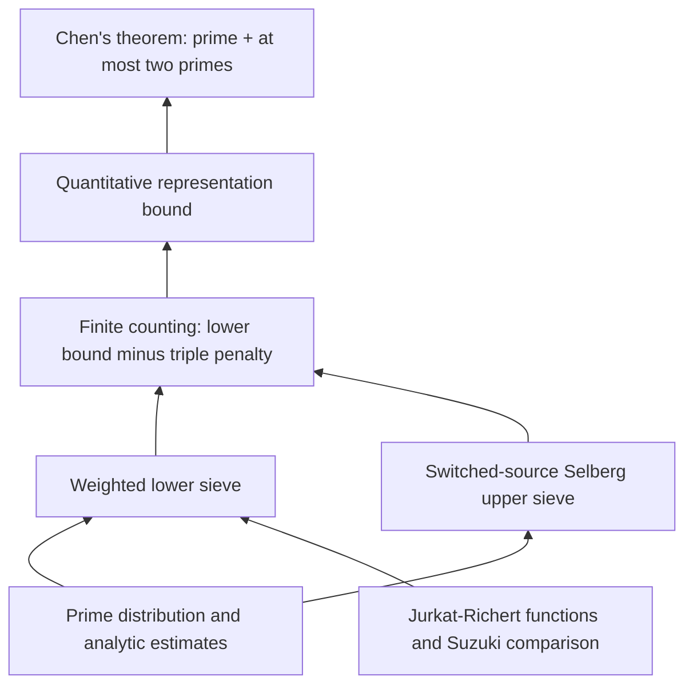

# goldbach-lean

A Lean 4 formalization of **Chen's 1+2 theorem**, preparing for **v1.0.0**:

every sufficiently large even natural number is the sum of a prime and either
a prime or a product of two primes. The two factors may be equal.

This is the version-one release candidate. It does **not** assert the binary
Goldbach conjecture, an explicit numerical threshold, or the separate 1+1.9
result.

See the [release notes](docs/RELEASE_NOTES.md) for the comparison with v1.0.0-rc1:
233,282 to 221,487 nonblank, comment-free Lean source lines, including Blueprint
metadata. No cross-machine build-time comparison is claimed.

| Read the mathematics | Explore the proof | Check the result |
|---|---|---|
| [Theorems and normalization](docs/THEOREMS.md) | [Architecture and source map](docs/ARCHITECTURE.md) | [Verification and trust boundary](docs/VERIFICATION.md) |

## Proof at a glance



This is a mathematical roadmap: arrows point from an input to the result it
supports, and may summarize several modules. The [source map](docs/ARCHITECTURE.md)
separates this view from direct imports and compiled declaration dependencies.

The [interactive Blueprint](docs/ARCHITECTURE.md#interactive-blueprint) renders
selected declaration dependencies from LeanArchitect, with links to their Lean
source. CI provides the generated site as the `goldbach-blueprint` artifact.

## Main results

```lean
import Goldbach

#check Goldbach.chen_theorem
#check Goldbach.representation_lower_bound
```

`Goldbach.chen_theorem` proves `Goldbach.ChenTheorem`. The specification in
[`Goldbach/Statement.lean`](Goldbach/Statement.lean) is deliberately independent
of the sieve implementation:

```lean
∃ N₀ : ℕ, ∀ N : ℕ, N₀ ≤ N → Even N →
  ∃ p q : ℕ, p.Prime ∧
    (q.Prime ∨ ∃ r s : ℕ, r.Prime ∧ s.Prime ∧ q = r * s) ∧ N = p + q
```

The quantitative theorem gives an eventual lower bound of
`0.67 * liuSingularSeries N * N / (Real.log N)^2` for the cardinality of the
actual good-representation set, for even `N`. See
[`docs/THEOREMS.md`](docs/THEOREMS.md) for definitions and normalization.

## Build and check

Install [elan](https://github.com/leanprover/elan), then run from this directory:

```sh
lake exe cache get
lake build
python3 scripts/check.py
lake env lean Goldbach/Checks.lean
lake env leanchecker --verbose Goldbach.Theorem
```

The toolchain and all Git dependencies are pinned by `lean-toolchain` and
`lake-manifest.json`. No sibling project, private path, or externally supplied
`LEAN_PATH` is required. `lake exe cache get` downloads Mathlib's compiled
cache; the project proofs themselves are built from source. `leanchecker`
performs a separate replay of compiled declarations; it is not a replacement
for the source build or the literal-statement check.

The checks reject proof placeholders and custom axioms in the shipped source,
verify the public theorem axiom reports against Lean's standard classical
axioms (`propext`, `Classical.choice`, `Quot.sound`), and check source hygiene.
Read [`docs/VERIFICATION.md`](docs/VERIFICATION.md) for the exact coverage and
limitations.

## Organization

- `Goldbach/`: independent statement, public theorems, and acceptance checks.
- `MathlibNt/`: Chen's sieve and analytic proof implementation.
- `AnalyticNumberTheory/`: reusable prime-distribution, Mertens, and sieve results.
- `PrimeNumberTheoremAnd/`: the attributed, adapted prime-number-theorem source closure.
- `scripts/`: reproducible source and trust checks.
- `docs/`: theorem map, architecture, provenance, and verification instructions.

The proof uses a modern combination of Jurkat–Richert/Richert linear sieve,
Suzuki comparison results, Selberg upper sieve, and proved distribution bounds.
It is **not** presented as a line-by-line reconstruction of Chen's 1973 paper.
See [`docs/ARCHITECTURE.md`](docs/ARCHITECTURE.md).

## Sources and license

Distributed under Apache-2.0. Upstream copyright notices are retained.
This project builds on `UyNewNas/chen-theorem-lean`,
`UyNewNas/analytic-number-theory-lean`, Mathlib, and the adapted source closure
of `AlexKontorovich/PrimeNumberTheoremAnd`. Attribution is described in
[`docs/PROVENANCE.md`](docs/PROVENANCE.md).
