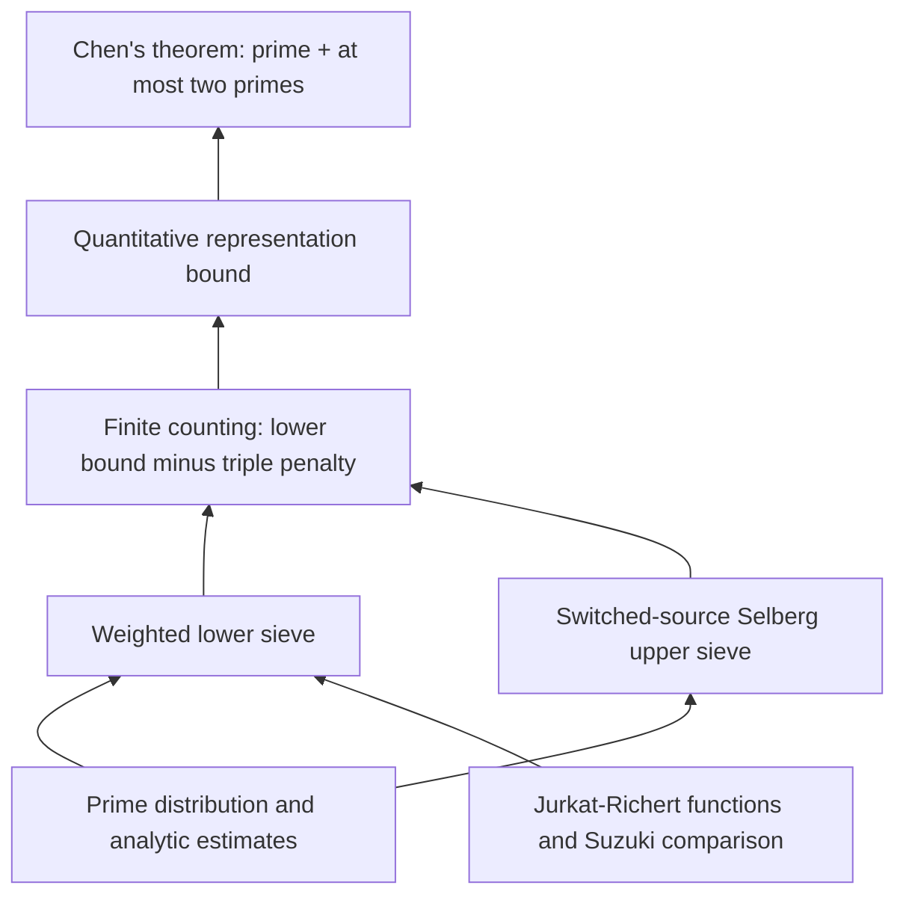

# goldbach-lean

A Lean 4 project formalizing progress toward **Goldbach's conjecture**, from
Chen's 1+2 theorem toward 1+1.9 and stronger results.

The first stable release, **v1.0.0**, formalizes **Chen's 1+2 theorem**:

> Every sufficiently large even natural number is the sum of a prime and either
> a prime or a product of two primes. The two factors may be equal.

Work on the 1+1.9 target is underway, with stronger results as a further research
direction. The theorem statements and documentation below describe the completed
1+2 development.

Compared with v1.0.0-rc1, this release reduces nonblank, comment-free Lean source
from **233,282 to 221,444 lines**, including Blueprint metadata. The recorded
clean builds took **36:23 and 30:06**; sampled proportional-memory peaks were
**5.97 and 6.85 GiB**, respectively. See the [release notes](docs/RELEASE_NOTES.md)
and [benchmark method and records](docs/BUILD_BENCHMARK.md).

**[Project homepage](https://subfish-zhou.github.io/goldbach-lean/)**
· **[Lean API documentation](https://subfish-zhou.github.io/goldbach-lean/docs/)**
· **[Interactive proof Blueprint](https://subfish-zhou.github.io/goldbach-lean/blueprint/)**

The Lean API documentation covers all four project libraries, with declaration
search, source links, and import navigation. See [how the website is built](docs/DOCUMENTATION.md).

| Read the mathematics | Explore the proof | Check the result |
|---|---|---|
| [Theorems and normalization](docs/THEOREMS.md) | [Architecture and source map](docs/ARCHITECTURE.md) | [Verification and trust boundary](docs/VERIFICATION.md) |

## Proof at a glance



This is a mathematical roadmap: arrows point from an input to the result it
supports, and may summarize several modules. The [source map](docs/ARCHITECTURE.md)
separates this view from direct imports and compiled declaration dependencies.

The [interactive Blueprint](https://subfish-zhou.github.io/goldbach-lean/blueprint/)
renders selected declaration dependencies from LeanArchitect, with links to their
Lean source. Continuous integration (CI) validates the documentation and assembles
the project homepage, Lean Doc, and Blueprint into one website, published from `main`. The Blueprint remains available as the `goldbach-blueprint` artifact.

## Main results

```lean
import Goldbach

#check Goldbach.chen_theorem
#check Goldbach.representation_lower_bound
```

`Goldbach.chen_theorem` proves `Goldbach.ChenTheorem`. The specification in
[`Goldbach/Statement.lean`](Goldbach/Statement.lean) is deliberately independent
of the sieve implementation:

```lean
∃ N₀ : ℕ, ∀ N : ℕ, N₀ ≤ N → Even N →
  ∃ p q : ℕ, p.Prime ∧
    (q.Prime ∨ ∃ r s : ℕ, r.Prime ∧ s.Prime ∧ q = r * s) ∧ N = p + q
```

The quantitative theorem gives an eventual lower bound of
`0.67 * liuSingularSeries N * N / (Real.log N)^2` for the cardinality of the
actual good-representation set, for even `N`. See
[`docs/THEOREMS.md`](docs/THEOREMS.md) for definitions and normalization.

## Build and check

Install [elan](https://github.com/leanprover/elan), then run from this directory:

```sh
unset LEAN_PATH LEAN_SRC_PATH
lake exe cache get
lake --wfail build
python3 scripts/check.py
lake env lean Goldbach/Checks.lean
lake env leanchecker --verbose Goldbach.Theorem
```

The toolchain and all Git dependencies are pinned by `lean-toolchain` and
`lake-manifest.json`. The checkout contains the complete local source closure.
`lake exe cache get` downloads Mathlib's compiled cache; the project proofs are
built from source. Verification combines the source build, the literal-statement
and axiom checks, and a separate replay of `Goldbach.Theorem` against its cached
imports using `leanchecker`.

The checks reject proof placeholders and custom axioms in the shipped source,
verify the public theorem axiom reports against Lean's standard classical
axioms (`propext`, `Classical.choice`, `Quot.sound`), and check source hygiene.
Read [`docs/VERIFICATION.md`](docs/VERIFICATION.md) for the exact coverage and
limitations.

## Organization

- `Goldbach/`: independent statement, public theorems, and acceptance checks.
- `MathlibNt/`: Chen's sieve and analytic proof implementation.
- `AnalyticNumberTheory/`: reusable prime-distribution, Mertens, and sieve results.
- `PrimeNumberTheoremAnd/`: the attributed, adapted prime-number-theorem source closure.
- `scripts/`: reproducible source and trust checks.
- `docs/`: theorem map, architecture, provenance, and verification instructions.

The proof uses a modern combination of Jurkat–Richert/Richert linear sieve,
Suzuki comparison results, Selberg upper sieve, and proved distribution bounds.
The [architecture guide](docs/ARCHITECTURE.md) explains how these ingredients
combine to prove the public results.

## Sources and license

Distributed under Apache-2.0. Upstream copyright notices are retained.
This project builds on `UyNewNas/chen-theorem-lean`,
`UyNewNas/analytic-number-theory-lean`, Mathlib, and the adapted source closure
of `AlexKontorovich/PrimeNumberTheoremAnd`. Attribution is described in
[`docs/PROVENANCE.md`](docs/PROVENANCE.md).
