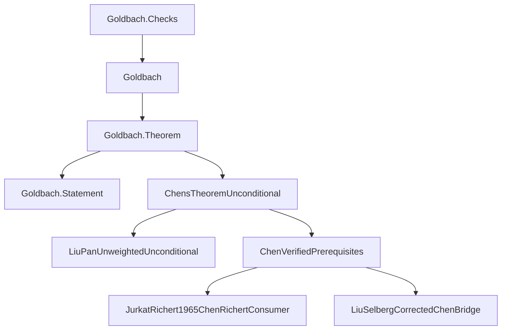
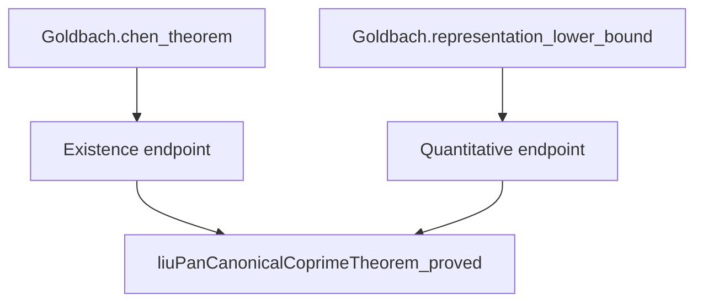

# Proof and software architecture

Follow the public statement down to its inputs, or start with an analytic
ingredient and work upward. The [README roadmap](../README.md#proof-at-a-glance)
shows the mathematics; the graph below shows the source boundary.

## Public import graph

Every arrow below is a **direct local import**, pointing from consumer to
dependency. This direction is the reverse of the mathematical roadmap.
External Mathlib imports and imports below the three bottom inputs are omitted.
The labels are shortened; the table supplies full source paths.



The statement is independent of the implementation, and the checks sit outside
the public import closure. Both public results enter through the same
implementation module; they have distinct endpoint declarations.

## Source reading route

| Step | Source | What to inspect |
|---|---|---|
| 1. Specification | [Goldbach/Statement.lean](../Goldbach/Statement.lean) | Literal quantifiers and prime-or-product conclusion |
| 2. Public results | [Goldbach/Theorem.lean](../Goldbach/Theorem.lean) | Existence theorem and quantitative representation bound |
| 3. Implementation endpoint | [MathlibNt/ChensTheoremUnconditional.lean](../MathlibNt/ChensTheoremUnconditional.lean) | How proved inputs discharge the final premises |
| 4. Counting assembly | [ChenVerifiedPrerequisites](../MathlibNt/SieveTheory/Chen/ChenVerifiedPrerequisites.lean) | Lower sieve, upper penalty, and actual representation count |
| 5a. Lower input | [JurkatRichert1965ChenRichertConsumer](../MathlibNt/SieveTheory/LinearSieve/JurkatRichert/JurkatRichert1965ChenRichertConsumer.lean) | Weighted lower bound for the actual Goldbach source |
| 5b. Upper input | [LiuSelbergCorrectedChenBridge](../MathlibNt/SieveTheory/Selberg/Liu/LiuSelbergCorrectedChenBridge.lean) | Selberg-square and triple-count transport |
| 5c. Distribution input | [LiuPanUnweightedUnconditional](../MathlibNt/SieveTheory/Distribution/LiuPan/LiuPanUnweightedUnconditional.lean) | Proved switched-source distribution estimate |
| 6. Acceptance boundary | [Goldbach/Checks.lean](../Goldbach/Checks.lean) | Literal target and public axiom reports |

For the almost-prime vocabulary, see
[MathlibNt/ChensTheorem.lean](../MathlibNt/ChensTheorem.lean).
For the distribution foundations, start with
[Bombieri1965Richert418Unconditional](../MathlibNt/AnalyticNumberTheory/BombieriVinogradov/Bombieri1965Richert418Unconditional.lean),
the [prime-counting interface](../AnalyticNumberTheory/PrimeDistribution/PrimeNumberTheorem.lean),
and its attributed [MediumPNT implementation](../PrimeNumberTheoremAnd/MediumPNT.lean).

## A shared declaration input

The two public endpoints reuse the same proved Liu-Pan distribution input.
These are selected **source-level declaration references**, with arrows from
consumer to dependency; other references are omitted.



In [ChensTheoremUnconditional](../MathlibNt/ChensTheoremUnconditional.lean), the
existence endpoint is `chens_theorem_unconditional` and the quantitative endpoint
is `chen_good_representations_lower_bound_unconditional`, both in namespace
`MathlibNt.ChensTheorem`. Each supplies the same proved input to its respective
conditional assembly in
[ChenVerifiedPrerequisites](../MathlibNt/SieveTheory/Chen/ChenVerifiedPrerequisites.lean).
In particular, the public existence theorem does **not** directly call the
public `0.67` representation theorem. The mathematical roadmap summarizes the
argument, not the exact declaration call graph.

## Public boundary

`Goldbach.Statement` defines the literal mathematical target using only basic
Mathlib notions. `Goldbach.Theorem` instantiates that target and exposes the
quantitative representation bound. `Goldbach.Checks` is a test module, not an
import of the public library.

The package contains the complete local import closure needed by the theorem.
It does not depend on a sibling analytics checkout. Git dependencies are pinned;
ported sources that required local adaptation are included with attribution.

## Mathematical dependency layers

1. **Prime-distribution foundations.** The adapted prime-number-theorem proof
   feeds natural prime counting and Mertens estimates. The analytic layer also
   establishes character, large-sieve, and distribution estimates.
2. **Linear sieve.** Constructed Jurkat–Richert delay functions provide concrete
   majorants. Suzuki comparison results supply the lower and uniformly
   conditioned upper estimates needed for the actual Goldbach densities.
3. **Weighted lower bound.** The Richert finite chain combines the base lower
   sieve, conditioned upper sieve, squareful corrections, prime integrals, and
   weighted Bombieri–Vinogradov error control.
4. **Switched-source upper bound.** The proved Liu–Pan distribution statement
   is transported to the coprime, weighted source consumed by the Selberg
   upper-sieve calculation. The aggregate source sum is retained inside the
   absolute value at its defining boundary.
5. **Finite counting bridge.** Exact candidate, penalty, and representation
   counts preserve factor multiplicities, boundary fibres, and integer cutoffs.
   The weighted lower estimate minus the triple penalty yields the actual
   representation lower bound.
6. **Final existence.** Positivity produces a representation for every
   sufficiently large even integer, and the public facade expands the
   almost-prime predicate into primes and products.

## Subsystem directory

The source reading route is intentionally small. Use these grouped directories
when following an input into its implementation.

<details>
<summary>Analytic estimates and prime distribution</summary>

| Directory | Responsibility |
|---|---|
| [LargeSieve](../MathlibNt/AnalyticNumberTheory/LargeSieve/) | Common moment, character, and large-sieve estimates |
| [Vaughan](../MathlibNt/AnalyticNumberTheory/Vaughan/) | Decomposition and Type I/II estimates |
| [DirichletL](../MathlibNt/AnalyticNumberTheory/DirichletL/) and [Siegel](../MathlibNt/AnalyticNumberTheory/Siegel/) | L-function and Siegel bounds |
| [BombieriVinogradov](../MathlibNt/AnalyticNumberTheory/BombieriVinogradov/) | Averaged-distribution assembly |
| [Chen1973](../MathlibNt/AnalyticNumberTheory/Chen1973/) | Retained source-specific analytic ingredients |
| [AnalyticNumberTheory](../AnalyticNumberTheory/) | Reusable prime-counting, Mertens, and sieve interfaces |
| [PrimeNumberTheoremAnd](../PrimeNumberTheoremAnd/) | Attributed and adapted PNT source closure |

</details>

<details>
<summary>Sieve, source models, and finite counting</summary>

| Directory | Responsibility |
|---|---|
| [Arithmetic](../MathlibNt/SieveTheory/Arithmetic/) | Singular-series, Mertens, and prime-sum normalization |
| [LinearSieve](../MathlibNt/SieveTheory/LinearSieve/) | Finite weights, Rosser boundaries, and applications |
| [Suzuki](../MathlibNt/SieveTheory/LinearSieve/Suzuki/) | Comparison and source-layer estimates |
| [JurkatRichert](../MathlibNt/SieveTheory/LinearSieve/JurkatRichert/) | Delay functions and the actual source consumer |
| [Richert](../MathlibNt/SieveTheory/LinearSieve/Richert/) | Weighted finite identities and error payment |
| [LevelSupported](../MathlibNt/SieveTheory/LinearSieve/LevelSupported/) | Supported-coefficient interfaces |
| [Distribution](../MathlibNt/SieveTheory/Distribution/) | Chen-facing distribution consumers and Liu-Pan estimates |
| [Selberg](../MathlibNt/SieveTheory/Selberg/) | Upper sieve and Liu source specialization |
| [Liu](../MathlibNt/SieveTheory/Liu/) | Source weights, prime-pair estimates, and integral bridges |
| [Switching](../MathlibNt/SieveTheory/Switching/) | Weighted counting, boundary comparisons, and endpoint assembly |

</details>

The [switching facade](../MathlibNt/SieveTheory/SwitchingPrinciple.lean) and
[linear-sieve facade](../MathlibNt/SieveTheory/LinearSieve.lean) expose focused
submodules. A physical module path identifies where to import a proof;
a declaration namespace identifies its stable mathematical name.

## Interactive Blueprint

[Goldbach/Blueprint.lean](../Goldbach/Blueprint.lean) annotates existing theorems
without changing their proofs. It is a separate documentation root: importing
`Goldbach` does not import these presentation attributes. The site contains
seven selected nodes and six inferred endpoint edges, not all project lemmas.
The three input nodes explicitly exclude upstream Blueprint labels from the
display; their complete Lean proof dependencies remain unchanged.

LeanArchitect produces the node data; LeanBlueprint renders the document and
interactive graph. In this graph arrows point from a dependency to its consumer,
opposite to the direct import graph above. Selecting a node opens its statement
summary and links to the document and original Lean source. The source links
use exported declaration positions and the rendering checkout's Git commit.
Render from a committed checkout for links that describe exactly that source.

Install Graphviz, its development headers, `pkg-config`, Python's venv support,
and `kpsewhich` (provided by `texlive-binaries` on Ubuntu). Then, from the project
root:

```sh
python3 -m venv .venv-blueprint
. .venv-blueprint/bin/activate
pip install -r blueprint/requirements.txt
lake build Goldbach:blueprint
leanblueprint web
leanblueprint serve
```

The site is generated under `blueprint/web`; the default preview is
`http://localhost:8000`. Generated HTML, exported TeX, and the Python environment
are ignored by Git. The verification workflow builds the same site after the
Lean checks and uploads it as `goldbach-blueprint`. Download that Actions
artifact to inspect a particular revision. GitHub Pages deployment is not
enabled by this configuration. PDF generation is not part of this release.

The small [source-link adapter](../blueprint/src/sources.py) prevents project
declarations from being sent to Mathlib's default documentation search.

## Reading dependency data

There are three useful views of the project, with different meanings:

| View | Nodes and edges | Suitable use |
|---|---|---|
| Mathematical roadmap | Ingredients and the results they support | Understand the argument before opening implementation files |
| Module DAG | Source modules and their direct imports | Navigate the code, find shared foundations, and identify rebuild impact |
| LeanArchitect declaration DAG | Compiled declarations and references in their types or proof values | Trace which lemmas a theorem uses and identify reusable proof interfaces |

LeanArchitect is pinned as a tooling dependency. Its graph is an inspection aid,
not an additional proof checker or a mathematical premise. An import edge does
not mean that every declaration in the imported module is used. Conversely,
a path in a declaration graph may pass through generated declarations rather
than a hand-written mathematical lemma.

For a release graph, build the exact release source first and export from that
compiled environment. Record the source revision, dirty-tree status, Lean and
dependency versions, graph roots, and whether edges come from types, values, or
both. A snapshot from before a refactor must not be labeled as the current graph.
The diagrams on this page are curated source navigation, not a fresh
LeanArchitect export or an exhaustive graph of the project.

A useful full atlas should open at the public results, group modules by the
subsystems above, and let readers expand one dependency neighborhood at a time.
Keep source links and edge direction visible. Keep raw export databases, timing
logs, and optimization ledgers outside the reading guide; their size and role
are different from release documentation. Graph reachability and duplicate-type
counts do not replace the [verification gates](VERIFICATION.md).

## Important interface distinctions

The actual Goldbach source density is `1 / (p - 1)`, not the literal
Jurkat–Richert specialization `1 / p`. The proof connects these through the
constructed sieve functions and comparison theorems; it does not identify the
two source models.

The modern upper comparison is not attributed to the literal 1965 theorem.
Likewise, proving the endpoint does not claim to reproduce every formula in
Chen's original paper. Source-specific module names identify mathematical
inputs, not a claim of historical verbatim replication.

A failed historical counting premise must not be used as the release endpoint.
The final route uses corrected finite counting and the actual good-representation
set, with all remaining analytic premises supplied by proved theorems.

## Engineering rules

- Public theorem names and statement meanings are stable across source reorganization.
- Mathematical declaration namespaces need not match physical subdirectories;
  this keeps existing proof references stable while modules are grouped by topic.
- Source dependencies flow toward the public facade; tests do not become its imports.
- Standalone imports and private helpers are verified after module splitting.
- No experimental worktree, build artifact, task transcript, or internal report
  belongs to the public source tree.
- Unreachable modules are excluded from this release, not automatically declared
  mathematically invalid. Shared dependencies remain even if they also serve
  work beyond the release theorem.
