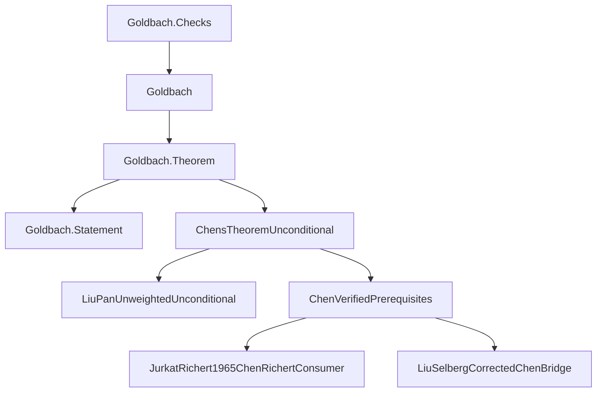
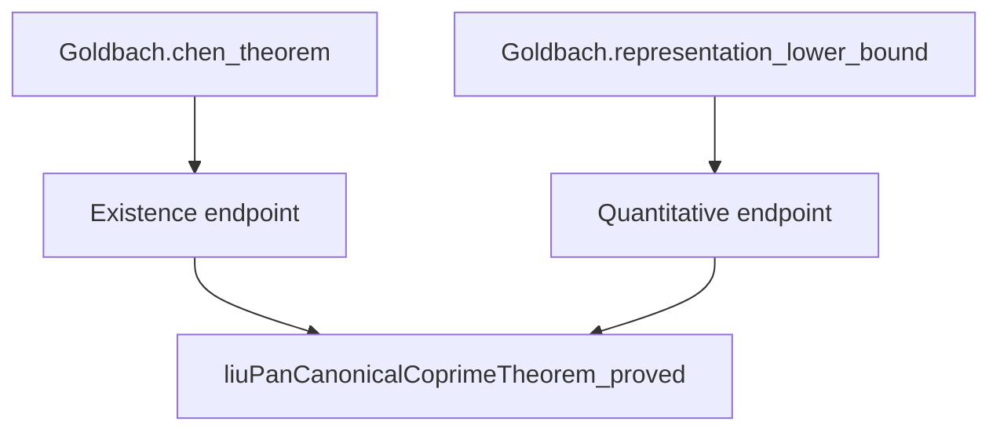

# Proof and software architecture

The completed Chen (1+2) and Li–Liu (1+1.9) developments have separate public
entries over shared analytic foundations. Li–Liu adds the literal factor-size
condition `r^10 ≤ q^9` to `N = p + r*q`, with `p, q` prime and `r = 1` or prime.
Follow either public statement down to its inputs, or start with an analytic
ingredient and work upward. The [README roadmap](../README.md#proof-at-a-glance)
shows the mathematics; the graph below shows the source boundary.

## Li–Liu extension

| Import / build target | Public results |
|---|---|
| `Goldbach` / `Goldbach.Theorem` | Chen existence and the `0.67` lower bound |
| `Goldbach.OnePlusOneNine` | Li–Liu natural-power and real-power existence, strict `0.0004` count, and fixed-coefficient lower bounds |
| `Goldbach.All` | Both interfaces |

`Goldbach.lean` and `MathlibNt.lean` retain the established 1+2 entry structure.
The new facade [Goldbach/OnePlusOneNine.lean](../Goldbach/OnePlusOneNine.lean)
imports the Li–Liu endpoints; [Goldbach/All.lean](../Goldbach/All.lean) joins the
two public entries. Shared foundations remain common dependencies, so existing
builds can retain their `.lake/` artifacts and compile the added route
incrementally. See the [target and upgrade commands](../README.md#focused-builds-and-upgrading-an-existing-checkout).

Start with the [literal representation and distinct-prime count](../MathlibNt/SieveTheory/LiLiuGoldbachOnePlusOneNineFinite.lean),
then the [unconditional existence endpoints](../MathlibNt/SieveTheory/LiLiuGoldbachOneNineUnconditional.lean)
and [quantitative assembly](../MathlibNt/SieveTheory/LiLiuGoldbachG11AuthorQuantitative.lean).
The quantitative assembly applies the G11 estimates to the original counts
and combines them with the certified G67, G9 and G12 integral estimates before
passing to `D19`. [THEOREMS.md](THEOREMS.md) records the exact coefficients,
normalization and quantifier order.

## Chen public import graph

Every arrow below is a **direct local import**, pointing from consumer to
dependency. This direction is the reverse of the mathematical roadmap.
External Mathlib imports and imports below the three bottom inputs are omitted.
The labels are shortened; the table supplies full source paths.



The statement is independent of the implementation, and the checks sit outside
the public import closure. Both Chen public results enter through the same
implementation module; they have distinct endpoint declarations.

## Proof elaboration tools

The shared derivative tactics live in
[`MathlibNt.Tactic.PolynomialDeriv`](../MathlibNt/Tactic/PolynomialDeriv.lean)
and [`MathlibNt.Tactic.ElementaryDeriv`](../MathlibNt/Tactic/ElementaryDeriv.lean).
They replace mechanical proof assembly, not the mathematical derivative formulas
or their domain hypotheses. Generated proof terms still pass through Lean's
kernel. The elementary tactic leaves any undischarged nonzero conditions as
ordinary goals and can reuse explicitly supplied derivative proofs.

See [derivative automation](DERIVATIVE_AUTOMATION.md) for the supported grammar,
regression tests, local timing observations and generated-name compatibility
boundary. These tools do not add a new number-theoretic premise or improve the
analytic constants.

## Source reading route

| Step | Source | What to inspect |
|---|---|---|
| 1. Specification | [Goldbach/Statement.lean](../Goldbach/Statement.lean) | Literal quantifiers and prime-or-product conclusion |
| 2. Public results | [Goldbach/Theorem.lean](../Goldbach/Theorem.lean) | Existence theorem and quantitative representation bound |
| 3. Implementation endpoint | [MathlibNt/ChensTheoremUnconditional.lean](../MathlibNt/ChensTheoremUnconditional.lean) | How proved inputs discharge the final premises |
| 4. Counting assembly | [ChenVerifiedPrerequisites](../MathlibNt/SieveTheory/Chen/ChenVerifiedPrerequisites.lean) | Lower sieve, upper penalty, and actual representation count |
| 5a. Lower input | [JurkatRichert1965ChenRichertConsumer](../MathlibNt/SieveTheory/LinearSieve/JurkatRichert/JurkatRichert1965ChenRichertConsumer.lean) | Weighted lower bound for the actual Goldbach source |
| 5b. Upper input | [LiuSelbergCorrectedChenBridge](../MathlibNt/SieveTheory/Selberg/Liu/LiuSelbergCorrectedChenBridge.lean) | Selberg-square and triple-count transport |
| 5c. Distribution input | [LiuPanUnweightedUnconditional](../MathlibNt/SieveTheory/Distribution/LiuPan/LiuPanUnweightedUnconditional.lean) | Proved switched-source distribution estimate |
| 6. Acceptance boundary | [Goldbach/Checks.lean](../Goldbach/Checks.lean) | Literal target and public axiom reports |

For the almost-prime vocabulary, see
[MathlibNt/ChensTheorem.lean](../MathlibNt/ChensTheorem.lean).
For the distribution foundations, start with
[Bombieri1965Richert418Unconditional](../MathlibNt/AnalyticNumberTheory/BombieriVinogradov/Bombieri1965Richert418Unconditional.lean),
the [prime-counting interface](../AnalyticNumberTheory/PrimeDistribution/PrimeNumberTheorem.lean),
and its attributed [MediumPNT implementation](../PrimeNumberTheoremAnd/MediumPNT.lean).

## A shared declaration input

The two Chen public endpoints reuse the same proved Liu-Pan distribution input.
These are selected **source-level declaration references**, with arrows from
consumer to dependency; other references are omitted.



In [ChensTheoremUnconditional](../MathlibNt/ChensTheoremUnconditional.lean), the
existence endpoint is `chens_theorem_unconditional` and the quantitative endpoint
is `chen_good_representations_lower_bound_unconditional`, both in namespace
`MathlibNt.ChensTheorem`. Each supplies the same proved input to its respective
conditional assembly in
[ChenVerifiedPrerequisites](../MathlibNt/SieveTheory/Chen/ChenVerifiedPrerequisites.lean).
The existence endpoint derives positivity through its own assembly; the
quantitative endpoint exposes the `0.67` representation bound. The mathematical
roadmap explains the argument, while this graph records the selected declaration
references.

## Public boundary

`Goldbach.Statement` defines the literal mathematical target using only basic
Mathlib notions. `Goldbach.Theorem` instantiates that target and exposes the
quantitative representation bound. `Goldbach.Checks` imports the public library
from a separate test module.

The package contains the complete local import closure needed by the theorem,
including the required analytics sources. Git dependencies are pinned; ported
sources that required local adaptation are included with attribution.

## Mathematical dependency layers

1. **Prime-distribution foundations.** The adapted prime-number-theorem proof
   feeds natural prime counting and Mertens estimates. The analytic layer also
   establishes character, large-sieve, and distribution estimates.
2. **Linear sieve.** Constructed Jurkat–Richert delay functions provide concrete
   majorants. Suzuki comparison results supply the lower and uniformly
   conditioned upper estimates needed for the actual Goldbach densities.
3. **Weighted lower bound.** The Richert finite chain combines the base lower
   sieve, conditioned upper sieve, squareful corrections, prime integrals, and
   weighted Bombieri–Vinogradov error control.
4. **Switched-source upper bound.** The proved Liu–Pan distribution statement
   is transported to the coprime, weighted source consumed by the Selberg
   upper-sieve calculation. The aggregate source sum is retained inside the
   absolute value at its defining boundary.
5. **Finite counting bridge.** Exact candidate, penalty, and representation
   counts preserve factor multiplicities, boundary fibres, and integer cutoffs.
   The weighted lower estimate minus the triple penalty yields the actual
   representation lower bound.
6. **Final existence.** Positivity produces a representation for every
   sufficiently large even integer, and the public facade expands the
   almost-prime predicate into primes and products.

## Subsystem directory

The source reading route is intentionally small. Use these grouped directories
when following an input into its implementation.

<details>
<summary>Analytic estimates and prime distribution</summary>

| Directory | Responsibility |
|---|---|
| [LargeSieve](../MathlibNt/AnalyticNumberTheory/LargeSieve/) | Common moment, character, and large-sieve estimates |
| [Vaughan](../MathlibNt/AnalyticNumberTheory/Vaughan/) | Decomposition and Type I/II estimates |
| [DirichletL](../MathlibNt/AnalyticNumberTheory/DirichletL/) and [Siegel](../MathlibNt/AnalyticNumberTheory/Siegel/) | L-function and Siegel bounds |
| [BombieriVinogradov](../MathlibNt/AnalyticNumberTheory/BombieriVinogradov/) | Averaged-distribution assembly |
| [Chen1973](../MathlibNt/AnalyticNumberTheory/Chen1973/) | Retained source-specific analytic ingredients |
| [AnalyticNumberTheory](../AnalyticNumberTheory/) | Reusable prime-counting, Mertens, and sieve interfaces |
| [PrimeNumberTheoremAnd](../PrimeNumberTheoremAnd/) | Attributed and adapted prime-number-theorem source closure |

</details>

<details>
<summary>Sieve, source models, and finite counting</summary>

| Directory | Responsibility |
|---|---|
| [Arithmetic](../MathlibNt/SieveTheory/Arithmetic/) | Singular-series, Mertens, and prime-sum normalization |
| [LinearSieve](../MathlibNt/SieveTheory/LinearSieve/) | Finite weights, Rosser boundaries, and applications |
| [Suzuki](../MathlibNt/SieveTheory/LinearSieve/Suzuki/) | Comparison and source-layer estimates |
| [JurkatRichert](../MathlibNt/SieveTheory/LinearSieve/JurkatRichert/) | Delay functions and the actual source consumer |
| [Richert](../MathlibNt/SieveTheory/LinearSieve/Richert/) | Weighted finite identities and error payment |
| [LevelSupported](../MathlibNt/SieveTheory/LinearSieve/LevelSupported/) | Supported-coefficient interfaces |
| [Distribution](../MathlibNt/SieveTheory/Distribution/) | Chen-facing distribution consumers and Liu-Pan estimates |
| [Selberg](../MathlibNt/SieveTheory/Selberg/) | Upper sieve and Liu source specialization |
| [Liu](../MathlibNt/SieveTheory/Liu/) | Source weights, prime-pair estimates, and integral bridges |
| [Switching](../MathlibNt/SieveTheory/Switching/) | Weighted counting, boundary comparisons, and endpoint assembly |

</details>

The [switching facade](../MathlibNt/SieveTheory/SwitchingPrinciple.lean) and
[linear-sieve facade](../MathlibNt/SieveTheory/LinearSieve.lean) expose focused
submodules. A physical module path identifies where to import a proof;
a declaration namespace identifies its stable mathematical name.

## Interactive Blueprint

[Goldbach/Blueprint.lean](../Goldbach/Blueprint.lean) attaches presentation
attributes to existing theorems through a separate documentation root. The
public `Goldbach` import and the Lean proofs remain unchanged. The Blueprint
starts with the counting objects and the two mathematical reductions, then
expands the analytic foundations, Chen's weighted sieve and penalty, and
Li–Liu's constrained-factor weights and signed integral estimates. Each proof
chapter has a graph with mathematical titles and its immediate external inputs.
A separate whole-document graph supports cross-chapter navigation.

The graph is a projection onto documented declarations. The prose explains
inputs, estimates, signs, boundary conditions and final error absorption; its
mathematical coverage is reviewed independently of the exact graph inventory.
Upstream presentation labels outside this roadmap are hidden while their
complete Lean proof dependencies remain unchanged.

LeanArchitect produces the node data; LeanBlueprint renders the document and
interactive graph. In this graph arrows point from a dependency to its consumer,
opposite to the direct import graph above. Selecting a node opens its statement
summary and links to the document and original Lean source. The source links
use exported declaration positions and the rendering checkout's Git commit.
Render from a committed checkout for links that describe exactly that source.

Install Graphviz, its development headers, `pkg-config`, Python's venv support,
and `kpsewhich` (provided by `texlive-binaries` on Ubuntu). Then, from the project
root:

```sh
python3 -m venv .venv-blueprint
. .venv-blueprint/bin/activate
pip install -r blueprint/requirements.txt
lake --wfail build Goldbach:blueprint
leanblueprint web
python3 scripts/verify_blueprint.py
leanblueprint serve
```

The site is generated under `blueprint/web`; the default preview is
`http://localhost:8000`. Generated HTML, exported TeX, and the Python environment
are ignored by Git. `verify_blueprint.py` checks the generated graph and reader
routes and writes `blueprint/web/build-info.json` with the source revision.
The independent local publication procedure combines the homepage at `/`,
[Lean API documentation](DOCUMENTATION.md) at `/docs/`, this Blueprint at
`/blueprint/`, and the Li–Liu proof structure at `/report/`. Dependency panels
load their internal renderer and data from `assets/dependencies/`. All paths are relative to the project site root.

The assembler takes a pre-generated structure directory through `--structure`;
it copies static inputs rather than extracting declarations or rebuilding Lean.
[Generation and publication commands](DOCUMENTATION.md#assemble-the-project-website)
use a new complete-site directory and a separate new staging checkout to publish
to `gh-pages`. The Lean workflow remains responsible for the full warning-free
build, source/statement/axiom checks, script tests and all five public/check
replays; it neither generates nor deploys the website. A successful source CI
run and a live [Pages](https://subfish-zhou.github.io/goldbach-lean/) deployment
are separate records. Verify the public build records after deployment before
identifying the new candidate as the online version.

The small [source-link adapter](../blueprint/src/sources.py) directs project
declaration links to their own source locations.

## Reading dependency data

Keep these three graph types distinct in labels, counts and navigation:

| View | Nodes and edges | Suitable use |
|---|---|---|
| Curated mathematical Blueprint | Authored selection of mathematical stages; prerequisite → consumer, with dependencies supplied by LeanArchitect | Read the argument and its explained analytic inputs |
| Module import graph | Source module → direct imported module; parsed imports cross-checked against compiled imports | Navigate source boundaries and inspect rebuild dependencies |
| Compiled declaration reference graph | Declaration → exact `Expr.const` reference, separated into `type`, proof/definition `value` and `recursorRHS` | Inspect actual stored expression dependencies and reusable interfaces |

The diagrams on this page and the README's mathematical roadmap are selected
navigation views. The Blueprint is also a selected explanatory projection.
Its graph inventory does not establish coverage of every compiled declaration.
In particular, a module import records access to a module; it must never be
called an actual proof/value dependency. A stored value reference identifies a
constant used in a theorem proof, definition or opaque value; type references
and recursor-rule references remain separate layers.

`scripts/build_project_structure.py` and `tools/ProjectStructure.lean` export
the full four-library census from existing compiled objects. Ownership comes
from `ModuleData.constNames`, checked against stored constants, rather than
namespace spelling. The export includes generated declarations, keeps all
actual providers of repeated names, and records `extraConstNames` boundaries.
It retains cycles and self-references. External or unresolved names stay
visible as `outside-local-census` references and are not recursively expanded.
The graph captures static expression references, not dynamic calls or the
tactic execution that constructed a proof.

Export after verifying the exact source and compiled inputs. The generated
`structure/build-info.json` and `structure/inputs.json` bind its census to the
source revision, toolchain and source/object fingerprints. The exporter checks
source revision, import agreement and input stability; it does not replay the
kernel. Every release still requires the [verification gates](VERIFICATION.md).

The [local website procedure](DOCUMENTATION.md) passes the export's inner
`structure/` directory to `build_site.py --structure`, alongside full API pages
and the rendered Blueprint. The API source revision and website revision may
differ when a compatible API artifact is reused, but both exact versions must
be recorded. Keep the API's original source links, the Blueprint's source
record, the structure fingerprint and the correspondence page's own source pins.
Keep source links and edge direction visible in the reader-facing explorer;
raw extraction caches, timing logs and private optimization ledgers remain
outside the static publication payload. Upstream licenses and attribution
remain as documented in [PROVENANCE.md](PROVENANCE.md).

## Important interface distinctions

The actual Goldbach source has density `1 / (p - 1)`. The literal
Jurkat–Richert specialization has density `1 / p`. These are distinct source
models, connected in the proof through constructed sieve functions and
comparison theorems.

The modern upper comparison comes from Suzuki's comparison results. The
implementation combines Chen's argument with the source variants documented in
each module; source-specific module names identify those mathematical inputs.

The final route uses corrected finite counting and the actual good-representation
set, with every analytic premise supplied by a proved theorem. Endpoint changes
must use valid counting premises for that set and discharge every analytic
premise. Historical counting errors must be corrected before those formulations
can enter the proof.

## Proof reuse and discovery

The public `goldbachProdPrimes_upperRosserCertificate` interface in
[LiLiuGoldbachB10RosserFactor](../MathlibNt/SieveTheory/LiLiuGoldbachB10RosserFactor.lean)
exposes the existing certificate for the shared prime product and logarithmic
cutoff. B8 and G11 retain their original certificate statements and consume this
lower interface; neither application is made a dependency of the other. The
mother weights and the later finite error sums remain application-specific.

The legacy finite singular-series upper and lower bounds reuse the corresponding
proved bounds in `AnalyticNumberTheory.Sieve.SingularSeries`. Both namespaces keep
their original finite definitions; this does not identify them with Liu's
infinite odd-prime singular series.

[LcmWeightBounds](../MathlibNt/AnalyticNumberTheory/LargeSieve/LcmWeightBounds.lean)
contains finite gcd-row, reciprocal-lcm and signed lcm-weight estimates. Its only
project dependency is the divisor-moment module. `PanV1SquareMean` specializes
its signed estimate to constant weights of order one, while
`LiLiuPrereqFouvryHighDeltaWeights` retains its original declarations as wrappers
and uses the same estimate in the large-gcd remainder. The elementary Pan bound
therefore acquires no smoothing or Poisson dependencies from this reuse.

The uniform `goldbachSieveProduct_lower_bound` specializes
`exists_goldbach_inverse_interval_bound` at lower endpoint two and takes
reciprocals after proving positivity. S1's auxiliary division and prime-count
bounds use the corresponding ordered-field and power-order interfaces in
Mathlib. The original types, including their parameter domains, are retained.

[FiniteFibres](../MathlibNt/SieveTheory/FiniteFibres.lean) transports a finite
labelled sum through a predicate on its output. It retains arbitrary weights
on individual labels and does not assume that the output map is injective.
The B8, B10 and S2 cardinality interfaces specialize the weight to one; G11
and G12 output-sieve interfaces keep their original coefficient weights.
The integer and real product-grouping statements independently specialize
Mathlib's fibrewise sum theorem, rather than casting real weights to integers.

[FiniteLabelCounting](../MathlibNt/SieveTheory/FiniteLabelCounting.lean)
bounds labelled incidences by counting the reverse fibres of an arbitrary
relation. The fixed-cutoff and variable-cutoff G11 exception bounds share
this argument without merging labels with equal products. The same module
proves fixed-output sigma-fibre injectivity from a positive retained factor
and a product bound; both are essential for natural-number subtraction.

[FiniteRealWindows](../MathlibNt/SieveTheory/FiniteRealWindows.lean) identifies
an arithmetic window `(L, U]` with the difference of two closed prefixes.
Its predicate is arbitrary. The G11/G12 applications retain primality and
the product congruence, and supply `0 <= L <= U <= N` from their geometric
bounds. Inverse residue classes and the later cardinality subtraction bridge
remain in the original application modules.
The exact AP-window counting interfaces are library consumers, not a
dependency of the current `one_plus_one_nine_count` proof body.

[MovingIntervalIntegral](../MathlibNt/Analysis/MovingIntervalIntegral.lean)
connects an integrable kernel on a region with inner section `(l(u), r(u)]`
to its iterated set integral. B8, B9, B10, the Liu source triangle, the
weighted Fouvry G9 region and B9-high supply their original regions,
measurability and integrability proofs. No ordering or regularity of the
endpoint functions is added to the shared interface; converting an oriented
interval integral to a set integral remains an application-specific step.
Empty sections stay empty. This continuous integration identity does not
remove discrete prime endpoint atoms.

[LogGridEstimates](../MathlibNt/Analysis/LogGridEstimates.lean) consolidates
reciprocal-kernel variation, exact half-open cell disjointness, weighted
cell evaluation and boundary-strip integration across Liu and B8/B9/B10.
The weight remains the actual logarithmic density, not an area surrogate.
The three-strip integral estimate is one-sided: each application retains its
own geometric excess cover, constants and integrability proofs. Liu and B10
also retain the separate lower bounds needed for their convergence results.

[BoundaryRegularity](../MathlibNt/SieveTheory/LinearSieve/BoundaryRegularity.lean)
proves joint continuity of complete moving integrals using a fixed local
integrable majorant. Compactness then supplies the original uniform moduli
directly, instead of repeatedly estimating common intervals and short strips.
The original depth induction, positive lower screens and zero-depth jump
exceptions remain. Clipping the inherited upper face at one is removed
exactly on the original domain; this gives no explicit convergence rate.

The [Jurkat--Richert auxiliary estimates](../MathlibNt/SieveTheory/JurkatRichert1965ChenGammaOneQOne.lean)
bound a smooth reciprocal tail directly by a finite weighted moment and its
Euler-product bound. The finite upper endpoint tends to infinity only after
fixing the other parameters; no uniform-in-parameter convergence is asserted.
A shared normalization of the existing Selberg estimate at the (4.1) cutoff
retains the complete squared-count error in both ratio branches. The original
cutoff definitions, absolute constants, threshold order and older auxiliary
interfaces remain available. This is a shorter proof of the existing auxiliary
bounds, not a stronger printed Jurkat--Richert rate or a replacement for the
deep prime-distribution inputs.

Both quantitative public entry points consume the shared log-grid layer,
through their own source estimates. The rewritten boundary-regularity and
Rankin interfaces remain library-level results: their changed proof bodies
are not reached by either current quantitative entry point. Importing their
modules is not counted as using those proofs.

The damped Perron estimates in
[DampedArctanHyperbolicPrimitiveL1](../MathlibNt/AnalyticNumberTheory/LargeSieve/DampedArctanHyperbolicPrimitiveL1.lean)
share a two-majorant integral bound and a single-character sharp-to-smoothed
comparison. The [selector version](../MathlibNt/AnalyticNumberTheory/LargeSieve/DampedArctanSelectorHyperbolicPrimitiveL1.lean)
applies that comparison at each cutoff `Y(q, chi)` before summing with the
nonnegative weight `q / phi(q)`. For natural `M >= 3`, rectangular coordinates in
`[1, M]`, `Q > 0` and `S` contained in `[1, Q]`, smoothing at `epsilon = M^-2`
gives the factors `1/2 + (7 log M + 2)/pi` for a common real smoothing parameter
in `[1/2, M+1/2]` and `1/2 + (14 log M + 4)/pi` for natural-valued selectors `Y(q, chi) <= M`.
These multiply the same aggregate rank-one large-sieve bound; the selector
keeps four rank-one contributions. The sharp comparison adds
`8/(pi M)` times the product of the rectangular coefficient L1 mass
and the weighted family mass.
Its single-character proof uses natural `M >= 1`, natural `Y <= M` and positive products;
the aggregate sharp interfaces also retain their product bound `m*n <= M`.

[SieveNormalization](../MathlibNt/Analysis/SieveNormalization.lean) separates
the elementary multiplication of lower bounds and cancellation of exponential
factors in upper bounds from the four Li--Liu count estimates. The applications
retain their actual main mass, singular series, remainder budget and parameter
ranges. The alpha lower bound also reuses the existing inverse-log absorption
estimate rather than reproving it locally.

[RealLogPowerThreshold](../MathlibNt/Analysis/RealLogPowerThreshold.lean)
packages the eventual domination of a fixed multiple of a real log power by
a positive power. The Suzuki applications choose the threshold before the
varying sieve and preserve their original same-constant and moving-depth
contracts. Other shortened portions use existing scalar bounds or algebra;
they are not new analytic estimates.

The shared Perron and Suzuki arguments occur in both quantitative proof
chains; these four count normalizations occur in the Li--Liu chain.
These refactorings share analytic and algebraic steps across the formal proofs.

The smoothed prime-number-theorem argument shares the norm bound for the
three factors of its integrand and the power identity on the right contour.
The nine contour pieces retain their signed recombination before norms are
taken; smoothing, outer-contour, shifted-contour and central errors remain
separate named bounds. The two infinite right-contour tails retain their
`X log X / (epsilon T)` scale.

The real-interval inverse-product bound uses one pair of integer cutoffs,
`k = max 2 (ceil z1 - 1)` and `n = max k (floor z2)`. This retains the closed
lower endpoint and covers empty sets and the small real range without a
second analytic argument. A fixed logarithmic comparison and exponential
bound then give one constant uniform in the finite set and both real endpoints.

`Arithmetic/GoldbachLiuProductBridge.lean` connects the actual finite sieve
product to twice Liu's odd-prime truncation times the ordinary prime product.
Its shared two-sided logarithmic bound serves the `S1` lower and `B10` upper
estimates. The strict prime cutoff, factor at 2 and finite-to-infinite
truncation errors are preserved rather than absorbed into a new assumption.

The Siegel--Walfisz contour estimates share the horizontal Mellin--Bochner
bound, the signed three-edge contour identity with its two tails, and the
scalar tail and smoothing estimates. The quadratic and nonquadratic
applications supply their own zero-free and logarithmic-derivative bounds.
The quadratic argument also pays its separate base term when transporting
from a negative left exponent. The horizontal bound and contour assembly live in
[ContourNormBounds](../MathlibNt/AnalyticNumberTheory/LargeSieve/DirichLTwistedSmoothedContourNormBounds.lean)
and [ErrorAssembly](../MathlibNt/AnalyticNumberTheory/LargeSieve/DirichLTwistedSmoothedNonquadraticErrorAssembly.lean).
The shared scalar estimates are in the
[nonquadratic pointwise argument](../MathlibNt/AnalyticNumberTheory/LargeSieve/DirichLTwistedNonquadraticPointwiseSiegelWalfisz.lean).

The Bombieri--Vinogradov small-cutoff argument in
[ChosenSmallSquare](../MathlibNt/AnalyticNumberTheory/LargeSieve/StandardBVChosenSmallSquare.lean)
has three steps: bound the actual weighted coefficient energy, bound the
complete squared-error expression, then absorb the remaining logarithmic
powers. Both the balanced and adaptive cutoffs use this argument. The adaptive
cutoff is eventually bounded by the balanced cutoff; it need not be monotone.
The modulus weight and all prefix and harmonic factors remain in the squared
expression. The zero-coefficient compatibility cutoff has its own interface.

The [high-conductor estimates](../MathlibNt/AnalyticNumberTheory/LargeSieve/StandardBVHighChosenUnconditional.lean)
reuse the quadratic Abel/conductor envelope from the
[block first-moment module](../MathlibNt/AnalyticNumberTheory/LargeSieve/StandardBVBlockL1WeightedPrimitive.lean):
`4 * discreteAbelAmplifierPrefixMax N * (conductorHarmonicFactor Q)^2 <= 48 log(N)^2`
for natural `B`, `N >= 3` and the actual Pan cutoff `Q = panModulusCutoff N B`,
including `Q = 0`. The chosen Type-I and Type-II estimates use this bound
directly; bare block sources keep their five-log reserve through its existing
corollary. The block assembler and the chosen small-term estimate also share
the step from a paid square ledger to the first moment. For conductor threshold
at least one and target `Z >= 0`, the payment `P^2 * (3 * H * L) <= Z^2`
yields `P * mean <= Z`, where `H` is the high-conductor harmonic factor and
`L` the actual primitive prefix-square ledger on the same high-conductor set.
The factor three stays in the payment; this square comparison permits signed
`P`, while the first-moment block estimates use a nonnegative multiplier.

The library's [conductor-change ledger](../MathlibNt/AnalyticNumberTheory/LargeSieve/ConductorChangeLevelLedger.lean)
first bounds each character's prefix maximum square by twice its primitive-conductor
prefix maximum square plus `8N` times the coefficient energy on the bad support.
That support consists of integers in `(M, M+N]` not coprime to the original
modulus. Summing with `q / phi(q)` and then regrouping the primitive term by
conductor gives the weighted nonprincipal ledger without repeating the
error estimate under nested sums. The principal term stays in its separate
exact splitting identity.

The library's [linear conductor transport](../MathlibNt/AnalyticNumberTheory/LargeSieve/ImprimitiveConductorWeightLinear.lean)
now obtains its prefix-square bound by directly applying the existing theorem
for any nonnegative family `F(d, psi)`. With natural `D > 0`, that theorem
transports the imprimitive-weighted sum on `[D, 2D]` to the primitive-weighted
sum on `[1, 2D]`, with factor `(Q / D) * conductorHarmonicFactor (Q / D)`;
`Q / D` is natural-number division. Substituting the actual primitive prefix
maximum square supplies the required nonnegativity and avoids repeating the
weight comparison and enlargement of the conductor window.

[SuzukiCaseIEndpointBudgetCore](../MathlibNt/SieveTheory/LinearSieve/Suzuki/SuzukiCaseIEndpointBudgetCore.lean)
uses the envelope-transport inequality supplied by each application at the
same sieve level to normalize the endpoint estimate, then combines three
source-order remainders against the same nonnegative budget. The strict Case-I and even-endpoint applications retain
their separate domains and choose their thresholds before the varying sieve.

In [Consequences](../PrimeNumberTheoremAnd/Consequences.lean), Abel summation
and the existing Chebyshev remainder estimate turn the theta asymptotic into
the prime-counting asymptotic. A separate equivalence puts the logarithmic
integral on the same scale. Its integral identity follows by differentiating
`t / log t` on `t > 1` and applying the fundamental theorem of calculus;
the endpoint formulas retain `2 <= a <= b`, including equality. The compatibility
code for the old generated matcher is isolated from this mathematical argument.

[Proof optimization tools](../tools/proofopt/README.md) provide source-pinned
compiled-expression indexing, bounded coverage probes and isolated proposals.
Candidate scores are not proofs. Full types and definition values, actual
consumer paths, standard axiom cones, source builds and independent kernel
replay are separate acceptance gates.

## Engineering rules

- Public theorem names and statement meanings are stable across source reorganization.
- Mathematical declaration namespaces stay stable while physical modules are
  grouped by topic.
- The public facade imports its proof dependencies; test modules remain outside
  the facade's import closure.
- Standalone imports and private helpers are verified after module splitting.
- Keep experimental worktrees, build artifacts, task transcripts, and internal
  reports outside the public source tree.
- Select release modules by reachability from the release roots. This is a
  packaging criterion; mathematical validity is assessed through proof checking.
  Retain shared dependencies, including those that also support further research.


## Character estimates and shared payments

The reduced-residue character estimate specializes the existing Parseval identity on units. The primitive-character estimate retains its separate direct orthogonal-family Bessel argument, using the existing inner-product and energy identifications. These are distinct proof routes. In the pointwise Siegel--Walfisz estimates, the horizontal contour edges are controlled by the tail term. The shared masked dyadic payment for the Fouvry estimates belongs to the existing MaskedW module; the callers retain their geometric hypotheses and threshold choices.


## S2 limit budget and Vaughan cell estimate

The S2 main-mass estimate combines the weighted logarithmic-kernel limit with its vanishing remainder contribution before choosing the final threshold. The comparison still uses the actual prime carrier, a larger prime window with nonnegative weights, and the original logarithmic coefficient. For the Vaughan all-aspect cell estimate, one local symmetric square-root estimate controls both cross terms. The argument retains the actual conductor cell, active rectangles, normalization, and the original four-term bound; the symmetric estimate is local to the proof rather than a new public interface.


## Weighted Perron norms and the S1 error budget

The selector estimate first bounds the nonnegative weighted sum of norms of the damped Perron integrals. The four selector-independent phase twists are controlled by the rank-one large-sieve energy bridge, and the two integrable majorants preserve the exact coefficient 14 log M + 4 before the signed Perron identity is averaged. The fixed-s S1 bound keeps the true carrier, sieve product and singular-series normalization: density and main-mass losses share the scalar delta budget, while half of that budget absorbs the paid Bombieri--Vinogradov remainder. A common threshold combines these estimates; S1 depends transitively on the selector rather than forming an independent branch.
