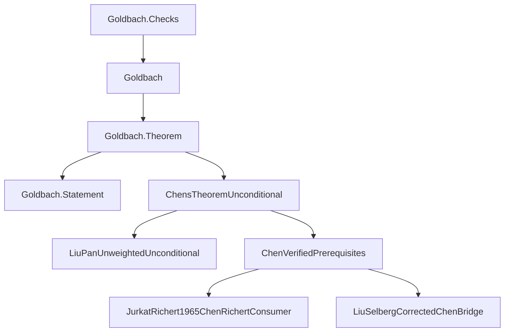
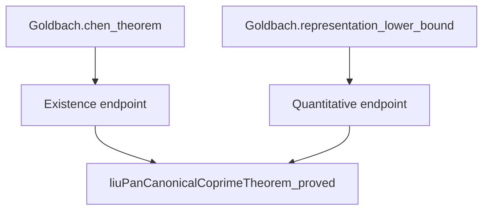

# Proof and software architecture

The completed Chen (1+2) and Li–Liu (1+1.9) developments have separate public
entries over shared analytic foundations. Li–Liu adds the literal factor-size
condition `r^10 ≤ q^9` to `N = p + r*q`, with `p, q` prime and `r = 1` or prime.
Follow either public statement down to its inputs, or start with an analytic
ingredient and work upward. The [README roadmap](../README.md#proof-at-a-glance)
shows the mathematics; the graph below shows the source boundary.

## Li–Liu extension

| Import / build target | Public results |
|---|---|
| `Goldbach` / `Goldbach.Theorem` | Chen existence and the `0.67` lower bound |
| `Goldbach.OnePlusOneNine` | Li–Liu natural-power and real-power existence, strict `0.0004` count, and fixed-coefficient lower bounds |
| `Goldbach.All` | Both interfaces |

`Goldbach.lean` and `MathlibNt.lean` retain the established 1+2 entry structure.
The new facade [Goldbach/OnePlusOneNine.lean](../Goldbach/OnePlusOneNine.lean)
imports the Li–Liu endpoints; [Goldbach/All.lean](../Goldbach/All.lean) joins the
two public entries. Shared foundations remain common dependencies, so existing
builds can retain their `.lake/` artifacts and compile the added route
incrementally. See the [target and upgrade commands](../README.md#focused-builds-and-upgrading-an-existing-checkout).

Start with the [literal representation and distinct-prime count](../MathlibNt/SieveTheory/LiLiuGoldbachOnePlusOneNineFinite.lean),
then the [unconditional existence endpoints](../MathlibNt/SieveTheory/LiLiuGoldbachOneNineUnconditional.lean)
and [quantitative assembly](../MathlibNt/SieveTheory/LiLiuGoldbachG11AuthorQuantitative.lean).
The quantitative assembly applies the G11 estimates to the original counts
and combines them with the certified G67, G9 and G12 integral estimates before
passing to `D19`. [THEOREMS.md](THEOREMS.md) records the exact coefficients,
normalization and quantifier order.

## Chen public import graph

Every arrow below is a **direct local import**, pointing from consumer to
dependency. This direction is the reverse of the mathematical roadmap.
External Mathlib imports and imports below the three bottom inputs are omitted.
The labels are shortened; the table supplies full source paths.



The statement is independent of the implementation, and the checks sit outside
the public import closure. Both Chen public results enter through the same
implementation module; they have distinct endpoint declarations.

## Source reading route

| Step | Source | What to inspect |
|---|---|---|
| 1. Specification | [Goldbach/Statement.lean](../Goldbach/Statement.lean) | Literal quantifiers and prime-or-product conclusion |
| 2. Public results | [Goldbach/Theorem.lean](../Goldbach/Theorem.lean) | Existence theorem and quantitative representation bound |
| 3. Implementation endpoint | [MathlibNt/ChensTheoremUnconditional.lean](../MathlibNt/ChensTheoremUnconditional.lean) | How proved inputs discharge the final premises |
| 4. Counting assembly | [ChenVerifiedPrerequisites](../MathlibNt/SieveTheory/Chen/ChenVerifiedPrerequisites.lean) | Lower sieve, upper penalty, and actual representation count |
| 5a. Lower input | [JurkatRichert1965ChenRichertConsumer](../MathlibNt/SieveTheory/LinearSieve/JurkatRichert/JurkatRichert1965ChenRichertConsumer.lean) | Weighted lower bound for the actual Goldbach source |
| 5b. Upper input | [LiuSelbergCorrectedChenBridge](../MathlibNt/SieveTheory/Selberg/Liu/LiuSelbergCorrectedChenBridge.lean) | Selberg-square and triple-count transport |
| 5c. Distribution input | [LiuPanUnweightedUnconditional](../MathlibNt/SieveTheory/Distribution/LiuPan/LiuPanUnweightedUnconditional.lean) | Proved switched-source distribution estimate |
| 6. Acceptance boundary | [Goldbach/Checks.lean](../Goldbach/Checks.lean) | Literal target and public axiom reports |

For the almost-prime vocabulary, see
[MathlibNt/ChensTheorem.lean](../MathlibNt/ChensTheorem.lean).
For the distribution foundations, start with
[Bombieri1965Richert418Unconditional](../MathlibNt/AnalyticNumberTheory/BombieriVinogradov/Bombieri1965Richert418Unconditional.lean),
the [prime-counting interface](../AnalyticNumberTheory/PrimeDistribution/PrimeNumberTheorem.lean),
and its attributed [MediumPNT implementation](../PrimeNumberTheoremAnd/MediumPNT.lean).

## A shared declaration input

The two Chen public endpoints reuse the same proved Liu-Pan distribution input.
These are selected **source-level declaration references**, with arrows from
consumer to dependency; other references are omitted.



In [ChensTheoremUnconditional](../MathlibNt/ChensTheoremUnconditional.lean), the
existence endpoint is `chens_theorem_unconditional` and the quantitative endpoint
is `chen_good_representations_lower_bound_unconditional`, both in namespace
`MathlibNt.ChensTheorem`. Each supplies the same proved input to its respective
conditional assembly in
[ChenVerifiedPrerequisites](../MathlibNt/SieveTheory/Chen/ChenVerifiedPrerequisites.lean).
The existence endpoint derives positivity through its own assembly; the
quantitative endpoint exposes the `0.67` representation bound. The mathematical
roadmap explains the argument, while this graph records the selected declaration
references.

## Public boundary

`Goldbach.Statement` defines the literal mathematical target using only basic
Mathlib notions. `Goldbach.Theorem` instantiates that target and exposes the
quantitative representation bound. `Goldbach.Checks` imports the public library
from a separate test module.

The package contains the complete local import closure needed by the theorem,
including the required analytics sources. Git dependencies are pinned; ported
sources that required local adaptation are included with attribution.

## Mathematical dependency layers

1. **Prime-distribution foundations.** The adapted prime-number-theorem proof
   feeds natural prime counting and Mertens estimates. The analytic layer also
   establishes character, large-sieve, and distribution estimates.
2. **Linear sieve.** Constructed Jurkat–Richert delay functions provide concrete
   majorants. Suzuki comparison results supply the lower and uniformly
   conditioned upper estimates needed for the actual Goldbach densities.
3. **Weighted lower bound.** The Richert finite chain combines the base lower
   sieve, conditioned upper sieve, squareful corrections, prime integrals, and
   weighted Bombieri–Vinogradov error control.
4. **Switched-source upper bound.** The proved Liu–Pan distribution statement
   is transported to the coprime, weighted source consumed by the Selberg
   upper-sieve calculation. The aggregate source sum is retained inside the
   absolute value at its defining boundary.
5. **Finite counting bridge.** Exact candidate, penalty, and representation
   counts preserve factor multiplicities, boundary fibres, and integer cutoffs.
   The weighted lower estimate minus the triple penalty yields the actual
   representation lower bound.
6. **Final existence.** Positivity produces a representation for every
   sufficiently large even integer, and the public facade expands the
   almost-prime predicate into primes and products.

## Subsystem directory

The source reading route is intentionally small. Use these grouped directories
when following an input into its implementation.

<details>
<summary>Analytic estimates and prime distribution</summary>

| Directory | Responsibility |
|---|---|
| [LargeSieve](../MathlibNt/AnalyticNumberTheory/LargeSieve/) | Common moment, character, and large-sieve estimates |
| [Vaughan](../MathlibNt/AnalyticNumberTheory/Vaughan/) | Decomposition and Type I/II estimates |
| [DirichletL](../MathlibNt/AnalyticNumberTheory/DirichletL/) and [Siegel](../MathlibNt/AnalyticNumberTheory/Siegel/) | L-function and Siegel bounds |
| [BombieriVinogradov](../MathlibNt/AnalyticNumberTheory/BombieriVinogradov/) | Averaged-distribution assembly |
| [Chen1973](../MathlibNt/AnalyticNumberTheory/Chen1973/) | Retained source-specific analytic ingredients |
| [AnalyticNumberTheory](../AnalyticNumberTheory/) | Reusable prime-counting, Mertens, and sieve interfaces |
| [PrimeNumberTheoremAnd](../PrimeNumberTheoremAnd/) | Attributed and adapted prime-number-theorem source closure |

</details>

<details>
<summary>Sieve, source models, and finite counting</summary>

| Directory | Responsibility |
|---|---|
| [Arithmetic](../MathlibNt/SieveTheory/Arithmetic/) | Singular-series, Mertens, and prime-sum normalization |
| [LinearSieve](../MathlibNt/SieveTheory/LinearSieve/) | Finite weights, Rosser boundaries, and applications |
| [Suzuki](../MathlibNt/SieveTheory/LinearSieve/Suzuki/) | Comparison and source-layer estimates |
| [JurkatRichert](../MathlibNt/SieveTheory/LinearSieve/JurkatRichert/) | Delay functions and the actual source consumer |
| [Richert](../MathlibNt/SieveTheory/LinearSieve/Richert/) | Weighted finite identities and error payment |
| [LevelSupported](../MathlibNt/SieveTheory/LinearSieve/LevelSupported/) | Supported-coefficient interfaces |
| [Distribution](../MathlibNt/SieveTheory/Distribution/) | Chen-facing distribution consumers and Liu-Pan estimates |
| [Selberg](../MathlibNt/SieveTheory/Selberg/) | Upper sieve and Liu source specialization |
| [Liu](../MathlibNt/SieveTheory/Liu/) | Source weights, prime-pair estimates, and integral bridges |
| [Switching](../MathlibNt/SieveTheory/Switching/) | Weighted counting, boundary comparisons, and endpoint assembly |

</details>

The [switching facade](../MathlibNt/SieveTheory/SwitchingPrinciple.lean) and
[linear-sieve facade](../MathlibNt/SieveTheory/LinearSieve.lean) expose focused
submodules. A physical module path identifies where to import a proof;
a declaration namespace identifies its stable mathematical name.

## Interactive Blueprint

[Goldbach/Blueprint.lean](../Goldbach/Blueprint.lean) attaches presentation
attributes to existing theorems through a separate documentation root. The
public `Goldbach` import and the Lean proofs remain unchanged. The Chen graph
presents seven selected nodes and six inferred endpoint edges. Its three input
nodes hide upstream Blueprint labels to keep the display focused on the endpoint
assembly; their complete Lean proof dependencies remain unchanged.

LeanArchitect produces the node data; LeanBlueprint renders the document and
interactive graph. In this graph arrows point from a dependency to its consumer,
opposite to the direct import graph above. Selecting a node opens its statement
summary and links to the document and original Lean source. The source links
use exported declaration positions and the rendering checkout's Git commit.
Render from a committed checkout for links that describe exactly that source.

Install Graphviz, its development headers, `pkg-config`, Python's venv support,
and `kpsewhich` (provided by `texlive-binaries` on Ubuntu). Then, from the project
root:

```sh
python3 -m venv .venv-blueprint
. .venv-blueprint/bin/activate
pip install -r blueprint/requirements.txt
lake --wfail build Goldbach:blueprint
leanblueprint web
leanblueprint serve
```

The site is generated under `blueprint/web`; the default preview is
`http://localhost:8000`. Generated HTML, exported TeX, and the Python environment
are ignored by Git. The verification workflow builds the same site after the
Lean checks and uploads it as `goldbach-blueprint`. Download that Actions
artifact to inspect a particular revision. The website has three entry points:
the standalone project homepage at `/`, [Lean API documentation](DOCUMENTATION.md)
at `/docs/`, and the interactive Blueprint at `/blueprint/`. These paths are
relative to the project site root. Successful `main` builds deploy the site to
[GitHub Pages](https://subfish-zhou.github.io/goldbach-lean/). The release
documentation build produces the web edition of the Blueprint.

The small [source-link adapter](../blueprint/src/sources.py) directs project
declaration links to their own source locations.

## Reading dependency data

There are three useful views of the project, with different meanings:

| View | Nodes and edges | Suitable use |
|---|---|---|
| Mathematical roadmap | Ingredients and the results they support | Understand the argument before opening implementation files |
| Module import graph | Source modules and their direct imports | Navigate the code, find shared foundations, and identify rebuild impact |
| LeanArchitect declaration graph | Compiled declarations and references in their types or proof values | Trace which lemmas a theorem uses and identify reusable proof interfaces |

LeanArchitect is pinned as a tooling dependency and supplies graphs for proof
inspection. Lean checks the proofs. A module import edge records access to a
module; a declaration edge records a reference in a type or proof value.
Declaration paths can pass through both hand-written lemmas and generated
declarations.

For a release graph, build the exact release source first and export from that
compiled environment. Record the source revision, dirty-tree status, Lean and
dependency versions, graph roots, and whether edges come from types, values, or
both. Label each snapshot with the revision it describes, and regenerate the
export after a refactor before publishing it as the current graph. The diagrams
on this page are curated source-navigation views of selected modules and
declarations.

A useful full atlas should open at the public results, group modules by the
subsystems above, and let readers expand one dependency neighborhood at a time.
Keep source links and edge direction visible. Keep raw export databases, timing
logs, and optimization ledgers outside the reading guide; their size and role
are different from release documentation. Every release must pass the
[verification gates](VERIFICATION.md); graph reachability and duplicate-type
counts serve as supplementary inspection data.

## Important interface distinctions

The actual Goldbach source has density `1 / (p - 1)`. The literal
Jurkat–Richert specialization has density `1 / p`. These are distinct source
models, connected in the proof through constructed sieve functions and
comparison theorems.

The modern upper comparison comes from Suzuki's comparison results. The
implementation combines Chen's argument with the source variants documented in
each module; source-specific module names identify those mathematical inputs.

The final route uses corrected finite counting and the actual good-representation
set, with every analytic premise supplied by a proved theorem. Endpoint changes
must use valid counting premises for that set and discharge every analytic
premise. Historical counting errors must be corrected before those formulations
can enter the proof.

## Engineering rules

- Public theorem names and statement meanings are stable across source reorganization.
- Mathematical declaration namespaces stay stable while physical modules are
  grouped by topic.
- The public facade imports its proof dependencies; test modules remain outside
  the facade's import closure.
- Standalone imports and private helpers are verified after module splitting.
- Keep experimental worktrees, build artifacts, task transcripts, and internal
  reports outside the public source tree.
- Select release modules by reachability from the release roots. This is a
  packaging criterion; mathematical validity is assessed through proof checking.
  Retain shared dependencies, including those that also support further research.
